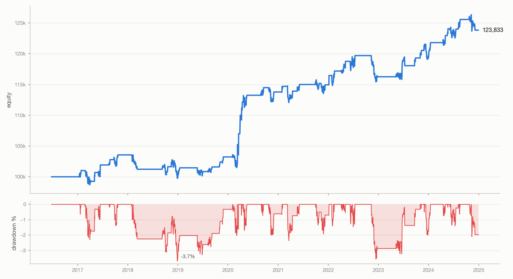
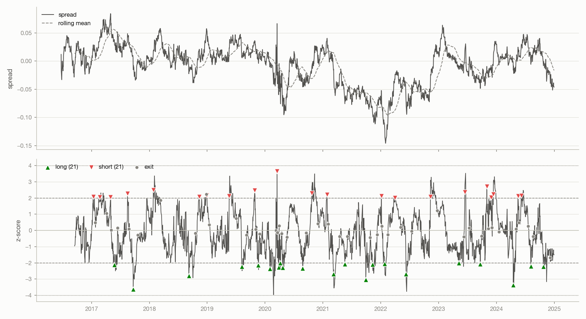
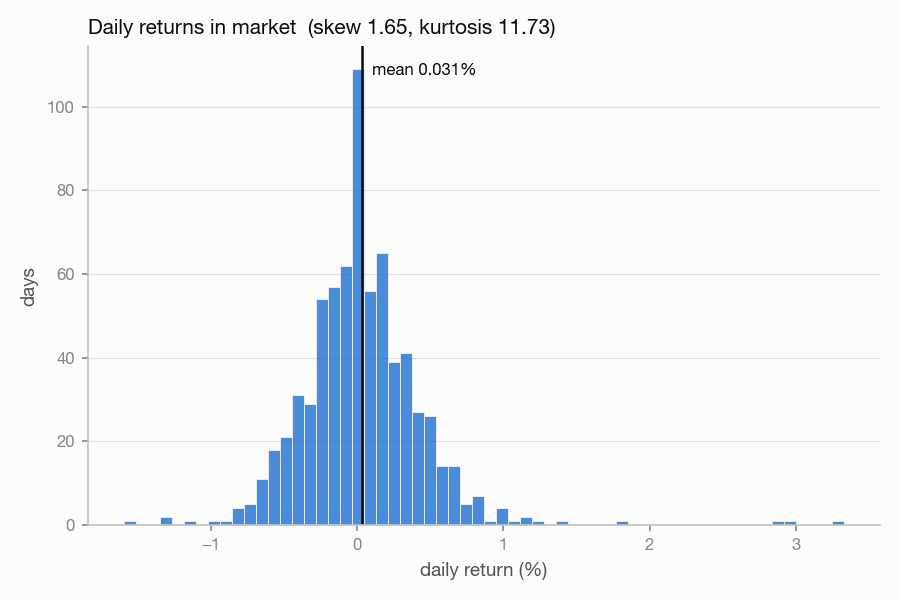
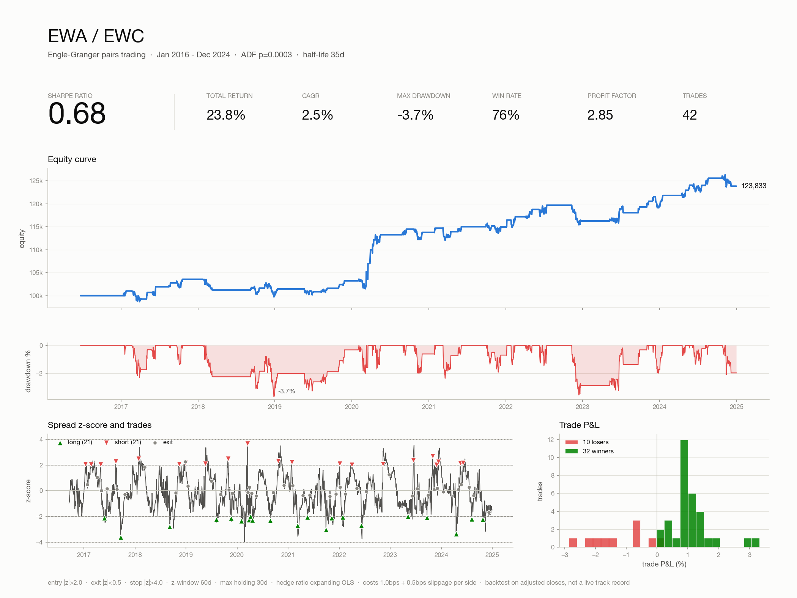

# stat-arb-backtest

Backtester de pairs trading estadístico desarrollado desde cero en Python.

El objetivo de este proyecto es estudiar si dos activos que presentan una relación de largo plazo pueden utilizarse para construir una estrategia de **mean reversion** sobre su spread.

No es un sistema de trading en producción ni un track record. Es un proyecto personal de investigación y aprendizaje para entender cómo llevar una idea de statistical arbitrage desde los datos hasta un backtest reproducible.

## Qué hace

El pipeline principal sigue estos pasos:

1. Descarga precios ajustados mediante `yfinance`.
2. Guarda los datos en Parquet para evitar descargas repetidas.
3. Comprueba la cointegración del par mediante Engle-Granger.
4. Estima el half-life de reversión del spread.
5. Calcula un hedge ratio dinámico para la estrategia.
6. Genera señales utilizando el z-score rolling del spread.
7. Ejecuta un backtest vectorizado con costes y slippage.
8. Calcula métricas de rendimiento y riesgo.
9. Genera gráficos y un tear sheet de una página.

## Idea teórica

En pairs trading no interesa tanto que dos activos tengan precios parecidos como que exista una **relación estable entre ellos a largo plazo**.

Dos series pueden ser no estacionarias individualmente y, aun así, existir una combinación lineal entre ellas que sí sea estacionaria. Cuando ocurre esto hablamos de **cointegración**.

En este proyecto se utiliza:

```text
spread = log(Y) - (alpha + beta * log(X))
```

Si el spread tiende a volver hacia su media, podemos intentar operar sus desviaciones:

* Cuando el spread está demasiado alto, se espera una reversión hacia abajo.
* Cuando está demasiado bajo, se espera una reversión hacia arriba.
* La posición se cierra cuando el spread vuelve cerca de su media.

La cointegración no significa que la estrategia vaya a ganar dinero. Solo proporciona una justificación estadística para estudiar la reversión del spread.

## Cointegración

Se implementa el test de **Engle-Granger en dos pasos**.

Primero se realiza una regresión OLS:

```text
Y = alpha + beta * X + residuo
```

donde `beta` puede interpretarse como hedge ratio.

Después se realiza un test ADF sobre los residuos.

El programa prueba las dos direcciones:

```text
Y ~ X
X ~ Y
```

y utiliza la dirección con menor p-valor.

El ADF se ejecuta sin término determinista (`regression="n"`). El p-valor utilizado es el del Dickey-Fuller estándar sobre los residuos, no el de Phillips-Ouliaris, por lo que debe interpretarse como ligeramente optimista.

Un par se considera cointegrado por defecto cuando:

```text
p-value < 0.05
```

Si el test no pasa este umbral, el programa no realiza el backtest salvo que se utilice `--force`.

## Half-life

Además del p-valor se estima el **half-life** de reversión.

Se ajusta un modelo sobre las diferencias del residuo:

```text
Δresid_t = alpha + k * resid_(t-1) + error
```

y, cuando `k < 0`, se calcula:

```text
half-life = -log(2) / k
```

La idea es estimar aproximadamente cuántos días necesita el spread para recorrer la mitad del camino hacia su media.

## Estrategia

El spread se calcula utilizando precios logarítmicos y un hedge ratio dinámico.

Una decisión importante del proyecto es que el beta utilizado por la estrategia **no es el beta estimado utilizando todo el histórico**.

El test de Engle-Granger utiliza una regresión sobre todo el período como diagnóstico. Para generar las señales, el hedge ratio se recalcula mediante un **expanding OLS**, utilizando únicamente la información disponible hasta cada momento.

Esto evita utilizar directamente un beta calculado con información futura en cada señal.

### Señales

Los parámetros por defecto son:

| Parámetro             |             Valor |   |        |
| --------------------- | ----------------: | - | ------ |
| Ventana z-score       |           60 días |   |        |
| Entrada               |                 ` | z | > 2.0` |
| Salida                |                 ` | z | < 0.5` |
| Stop                  |                 ` | z | > 4.0` |
| Máximo de permanencia |           30 días |   |        |
| Hedge ratio           |     Expanding OLS |   |        |
| Mínimo para hedge     | 120 observaciones |   |        |

La posición del spread se interpreta así:

```text
z >= +2  -> short spread
z <= -2  -> long spread
```

La posición se cierra cuando el z-score vuelve por debajo de `0.5` en valor absoluto, alcanza el stop de `4.0` o supera el máximo de 30 días.

No se abren nuevas posiciones fuera de la banda de stop.

## Exposición y costes

Los pesos de las dos patas se escalan mediante:

```text
1 / (1 + |beta|)
```

de forma que la exposición bruta del trade sea 1.

Los costes se calculan sobre el **turnover real**, incluyendo los cambios de peso producidos por la evolución del hedge ratio.

Configuración utilizada en los ejemplos:

```text
coste: 1.0 bps
slippage: 0.5 bps
```

por lado.

Además, las señales generadas al cierre de una sesión solamente generan retorno a partir de la siguiente sesión. Esto evita que una señal calculada en `t` gane directamente el retorno de `t`.

## Estructura del proyecto

```text
stat-arb-backtest/
├── src/
│   ├── analysis/
│   │   └── cointegration.py
│   ├── backtest/
│   │   └── engine.py
│   ├── data/
│   │   └── fetcher.py
│   ├── strategy/
│   │   └── pairs.py
│   └── visualization/
│       └── plots.py
├── data_cache/
├── output/
├── config.yaml
├── main.py
├── requirements.txt
└── .gitignore
```

### `src/data/fetcher.py`

Descarga los precios mediante `yfinance`, los normaliza y los guarda en formato Parquet.

También realiza un `forward fill` limitado a tres observaciones para pequeños huecos producidos por calendarios de mercado diferentes antes de eliminar las filas que todavía no tengan datos completos.

### `src/analysis/cointegration.py`

Contiene la implementación del test de Engle-Granger, cálculo del hedge ratio, half-life y screening de combinaciones de pares.

### `src/strategy/pairs.py`

Construye el spread, calcula el hedge ratio dinámico, el z-score rolling y la máquina de estados que transforma el z-score en posiciones.

### `src/backtest/engine.py`

Calcula el P&L de las posiciones, pesos de las patas, turnover, costes, equity curve, operaciones y métricas.

### `src/visualization/plots.py`

Genera:

* Equity curve
* Spread con señales
* Distribución de returns
* Tear sheet de una página

### `main.py`

Es el punto de entrada del proyecto y conecta descarga de datos, cointegración, estrategia, backtest y visualización mediante `argparse`.

## Instalación

Se recomienda utilizar Python 3.11 o superior.

Clonar el repositorio y entrar en la carpeta:

```bash
git clone <URL_DEL_REPOSITORIO>
cd stat-arb-backtest
```

Crear un entorno virtual:

```bash
python -m venv .venv
```

Activarlo en macOS/Linux:

```bash
source .venv/bin/activate
```

En Windows:

```bash
.venv\Scripts\activate
```

Instalar las dependencias:

```bash
pip install -r requirements.txt
```

## Dependencias

El proyecto utiliza principalmente:

* Python 3.11+
* pandas
* numpy
* statsmodels
* matplotlib
* yfinance
* PyYAML
* pyarrow
* scipy

## Uso

El proyecto utiliza `config.yaml` como configuración principal.

Para ejecutar el backtest con la configuración por defecto:

```bash
python main.py
```

La configuración incluida por defecto utiliza:

```text
KO / PEP
2015-01-01 -> 2024-12-31
```

### Cambiar el par

Se pueden sobrescribir los tickers definidos en `config.yaml`:

```bash
python main.py --tickers EWA EWC
```

El orden importa porque define el par `Y / X` que recibe el pipeline, aunque el test de cointegración prueba ambas direcciones.

### Cambiar las fechas

```bash
python main.py --start 2016-01-01 --end 2024-12-31
```

### Cambiar los parámetros de entrada y salida

```bash
python main.py --entry-z 2.0 --exit-z 0.5 --stop-z 4.0
```

### Cambiar la ventana del z-score

```bash
python main.py --z-window 60
```

### Cambiar los costes

```bash
python main.py --cost-bps 1.0
```

El slippage se mantiene según `config.yaml`.

### Desactivar la caché

```bash
python main.py --no-cache
```

Esto fuerza una nueva descarga de los precios.

### No generar gráficos

```bash
python main.py --no-plots
```

### Cambiar la carpeta de salida

```bash
python main.py --outdir results
```

### Forzar un par que no pasa el test

Por defecto, un par con `p-value >= 0.05` es rechazado.

Para ejecutar igualmente el backtest:

```bash
python main.py --tickers KO NVDA --force
```

Esta opción existe principalmente para poder investigar qué ocurre con un par que no cumple el criterio estadístico. No significa que el programa considere que ese par sea adecuado.

### Cambiar el nivel de logs

```bash
python main.py --log-level DEBUG
```

## `config.yaml`

La configuración principal es:

```yaml
data:
  tickers: [KO, PEP]
  start: "2015-01-01"
  end: "2024-12-31"
  interval: 1d
  use_cache: true

cointegration:
  pvalue_threshold: 0.05
  maxlag: null

strategy:
  use_log_prices: true
  z_window: 60
  hedge_window: null
  hedge_min_periods: 120
  entry_z: 2.0
  exit_z: 0.5
  stop_z: 4.0
  max_holding_days: 30

backtest:
  capital: 100000
  cost_bps: 1.0
  slippage_bps: 0.5
  ann_factor: 252

output:
  dir: output
  save_plots: true
  save_trades: true
```

`hedge_window: null` significa que la estrategia utiliza un hedge ratio expanding en lugar de una ventana rolling fija.

El capital inicial solo afecta a la escala de la equity curve; los retornos y las métricas porcentuales se calculan a partir de los returns del backtest.

## Métricas

El motor calcula, entre otras:

| Métrica                | Descripción                                      |
| ---------------------- | ------------------------------------------------ |
| Sharpe                 | Retorno medio ajustado por volatilidad           |
| Sortino                | Retorno ajustado utilizando volatilidad negativa |
| CAGR                   | Tasa de crecimiento anual compuesta              |
| Volatilidad anualizada | Desviación estándar anualizada                   |
| Max drawdown           | Mayor caída desde un máximo anterior             |
| Calmar                 | CAGR dividido por el drawdown máximo             |
| Win rate               | Porcentaje de operaciones ganadoras              |
| Profit factor          | Beneficios brutos / pérdidas brutas              |
| Número de operaciones  | Total de trades                                  |
| Duración media         | Días medios en cada operación                    |
| Exposición             | Porcentaje de días con posición                  |

## Resultados de ejemplo

Los siguientes resultados corresponden a **ejecuciones reales que he realizado con el proyecto**.

Los resultados se incluyen como ejemplos para mostrar el funcionamiento del backtester y no como una demostración de que la estrategia vaya a funcionar en el futuro.

### EWA / EWC

ETFs de Australia y Canadá.

Período: `2016-2024`

| Métrica       | Resultado |
| ------------- | --------: |
| ADF p-value   |    0.0003 |
| Half-life     |   35 días |
| Sharpe        |      0.68 |
| Retorno total |     23.8% |
| CAGR          |      2.5% |
| Max drawdown  |     -3.7% |
| Win rate      |       76% |
| Profit factor |      2.85 |
| Operaciones   |        42 |

Costes utilizados:

```text
1.0 bps + 0.5 bps de slippage por lado
```

Este resultado es interesante como ejercicio porque el par pasa claramente el test de cointegración y muestra una reversión relativamente rápida del spread.

Aun así, el resultado no debe interpretarse como una estimación de lo que ocurriría operando en real.

### KO / PEP

Período: `2015-2024`

| Métrica     | Resultado |
| ----------- | --------: |
| ADF p-value |    0.0105 |
| Half-life   |   93 días |
| Sharpe      |      0.11 |
| Operaciones |        43 |

KO/PEP es un ejemplo especialmente útil porque ha sido un par clásico de pairs trading, pero el backtest muestra que una relación histórica no garantiza que siga existiendo un edge suficiente.

En este caso, el poco edge que queda está muy condicionado por los costes.

### KO / NVDA

El par es rechazado por el test de cointegración:

| Métrica     | Resultado |
| ----------- | --------: |
| ADF p-value |     0.062 |

Por defecto el programa se niega a realizar el backtest.

Para ejecutarlo hay que utilizar explícitamente:

```bash
python main.py --tickers KO NVDA --force
```

Esto permite separar la decisión estadística del hecho de querer experimentar con el par.

## Resultados visuales

Además de las métricas numéricas, el proyecto genera varias visualizaciones para poder analizar el comportamiento del backtest.

Las imágenes que aparecen a continuación son **ejemplos de ejecuciones que he realizado personalmente con el proyecto** y están incluidas en la carpeta `output/`.

### Equity curve

Muestra la evolución del capital durante el período analizado y permite identificar visualmente los períodos de drawdown.



### Spread y señales

Muestra el comportamiento del spread y las señales generadas por la estrategia.



### Distribución de returns

Muestra la distribución de los retornos obtenidos durante el backtest.



### Tear sheet

El tear sheet reúne en una sola imagen la equity curve, drawdown, principales métricas, z-score y distribución del P&L de las operaciones.



### Sobre la terminología de las gráficas

Aunque el README está escrito en español, algunas etiquetas de las gráficas aparecen en inglés, como `Equity`, `Drawdown`, `Sharpe`, `Spread` o `Return`.

He mantenido esta terminología porque es bastante habitual en análisis cuantitativo y permite conservar los nombres técnicos utilizados habitualmente en este tipo de proyectos.

## Outputs

Cuando la generación de resultados está activada, el proyecto puede producir:

```text
output/
├── equity.csv
├── trades.csv
├── equity_curve.png
├── spread_signals.png
├── return_distribution.png
└── tearsheet.png
```

Los archivos CSV contienen los resultados numéricos del backtest y las operaciones realizadas, mientras que los archivos PNG permiten analizar visualmente el resultado.

## Limitaciones

Hay varias limitaciones importantes que hacen que estos resultados no deban interpretarse como una estrategia lista para operar con dinero real.

### 1. No existe separación in-sample / out-of-sample

Los parámetros y umbrales se han elegido observando el histórico completo.

Por tanto, existe **overfitting** y el Sharpe obtenido puede estar inflado.

Esta es probablemente la principal limitación metodológica del proyecto. Una siguiente evolución lógica sería separar el proceso de selección de parámetros de la evaluación final mediante períodos out-of-sample o walk-forward.

### 2. No se modela el préstamo del lado corto

El backtest no incluye:

* Disponibilidad real de acciones para vender en corto.
* Coste de borrow.
* Cambios en el borrow a lo largo del tiempo.

### 3. Ejecución simplificada

El modelo utiliza una ejecución simplificada basada en cierres.

No existe un modelo detallado de:

* Bid/ask spread real.
* Market impact.
* Latencia.
* Slippage dependiente del tamaño.
* Liquidez intradía.

### 4. Precios ajustados

El backtest utiliza precios ajustados obtenidos mediante `yfinance`.

Por tanto, los resultados son una simulación histórica sobre precios y no un track record de una estrategia realmente ejecutada.

### 5. La cointegración puede cambiar

Que dos activos estén cointegrados durante un período no significa que la relación vaya a permanecer estable.

Los resultados históricos pueden dejar de representar el comportamiento futuro del par.

## Qué he aprendido con el proyecto

La parte que más me interesaba de este proyecto no era únicamente conseguir una equity curve, sino entender qué decisiones hay detrás de un backtest.

Por ejemplo, utilizar el beta calculado con todo el histórico habría sido sencillo, pero habría introducido información futura en las señales. Por eso la estrategia utiliza un hedge ratio expanding.

También me ha servido para comprobar que pasar un test estadístico no significa automáticamente tener una estrategia con buen rendimiento. KO/PEP es un buen ejemplo dentro de este proyecto.

La siguiente evolución que me gustaría estudiar es cómo cambia el resultado al introducir una separación entre entrenamiento y evaluación, especialmente mediante validación walk-forward.

## Licencia

Este proyecto se distribuye bajo licencia MIT.

Consulta el archivo `LICENSE` para conocer los términos completos.
